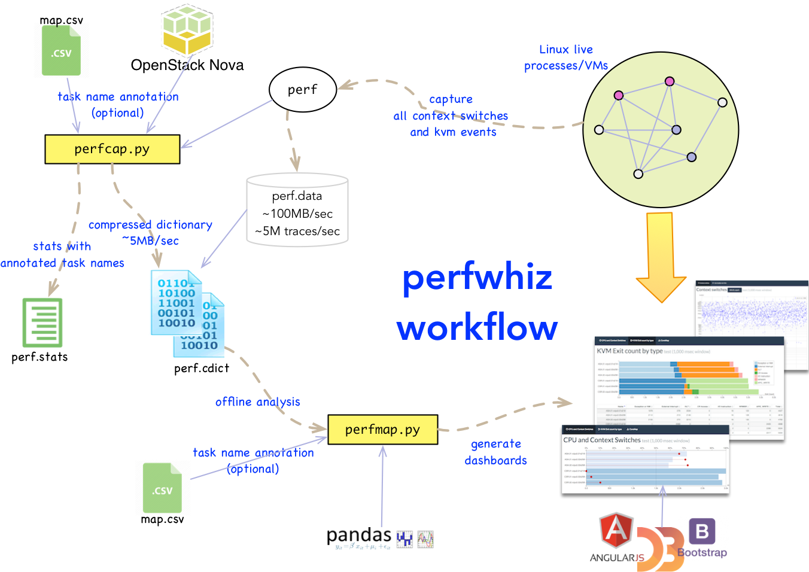

========
Overview
========

This repository contains a set of python scripts for helping tune any Linux
system for performance and scale by leveraging the Linux *perf* tool and
generating from the perf traces 2 HTML dashboards that represent Linux scheduler context switches
and KVM events.

The basic dashboard illustrates general scheduler and KVM events for all tasks selected at capture time:

- CPU Usage vs. context switches chart
- KVM exit types distribution stacked bar charts (exit type distribution per task)
- Summary CoreMap showing task scheduler core assignment and context switch count heat maps (run time % and context switch count on each core per task - including total time per core and per task)

The detailed dashboard illustrates detailed scheduler and KVM events at the task level:

- context switch heat maps (temporal distribution of context switch events)
- KVM exit heat maps (temporal distribution of kvm entry and exit events)
- Temporal Coremaps (on which core does any given task run over time)

The task annotation feature further allows the generation of cross-run charts (diffs) that can help
detect more easily differences of behavior across multiple captures/runs.

The capture script wraps around the Linux perf tool to capture events of
interest (such as context switches and kvm events) and generates a much more
compact binary file to be used for analysis offline.

Complete documentation including installation and usage instructions:

    http://perfwhiz.readthedocs.org/

perfwhiz Workflow
-----------------

The following diagram illustrates the 2 phases for getting the dashboards: capture phase (perfcap.py) and dashboard generation phase (perfmap.py).

Capture is performed on the system under test, by invoking the perfcap.py script and specify which tasks to capture events from and for how long.
The result of each capture is a binary file (with the cdict extension, cdict stands for compressed dictionary).

The binary files can then later be provided to the dashboard generation tool (perfmap.py) to generate the corresponding dashboards.
This dashboard generation phase is typically done offline on a workstation where perfmap is installed (laptop, macbook...).
The generated dashboards are HTML files that can be viewed using any browser.

Dependencies
------------
Dependencies are automatically installed when perfwhiz is being installed (refer to the Installation section).

The capture tool perfcap.py depends on:

- the Linux perf tool (compiled with the python extension)
- pbr python package
- msgpack python package

The dashboard generation tool perfmap.py depends on:

- pandas/numpy python package

The generated HTML dashboards contain Javascript code that will pull some Javascript libraries from CDN servers
when loaded in the browser (CDN is a public network of servers that contain libraries that are downloaded by browsers).
Therefore, viewing those dashboards require access to the Internet.
The following Javascript libraries are required by the dashboards:

- jquery
- datatables
- d3
- angular
- angular-ui-bootstrap
- pako (zlib inflate)

Licensing
---------

perfwhiz is licensed under the Apache License, Version 2.0 (the "License").
You may not use this tool except in compliance with the License.
You may obtain a copy of the License at
`<http://www.apache.org/licenses/LICENSE-2.0>`_

Unless required by applicable law or agreed to in writing, software
distributed under the License is distributed on an "AS IS" BASIS,
WITHOUT WARRANTIES OR CONDITIONS OF ANY KIND, either express or implied.
See the License for the specific language governing permissions and
limitations under the License.

Links
-----

* Documentation: http://perfwhiz.readthedocs.org/en/latest/
* Source: https://github.com/cisco-oss-eng/perfwhiz
* Supports/Bugs: https://github.com/cisco-oss-eng/perfwhiz
* Gitter Room: https://gitter.im/cisco-oss-eng/perfwhiz

.. image:: https://badges.gitter.im/Join%20Chat.svg
   :alt: Join the chat at https://gitter.im/cisco-oss-eng/perfwhiz
   :target: https://gitter.im/cisco-oss-eng/perfwhiz?utm_source=badge&utm_medium=badge&utm_campaign=pr-badge&utm_content=badge
