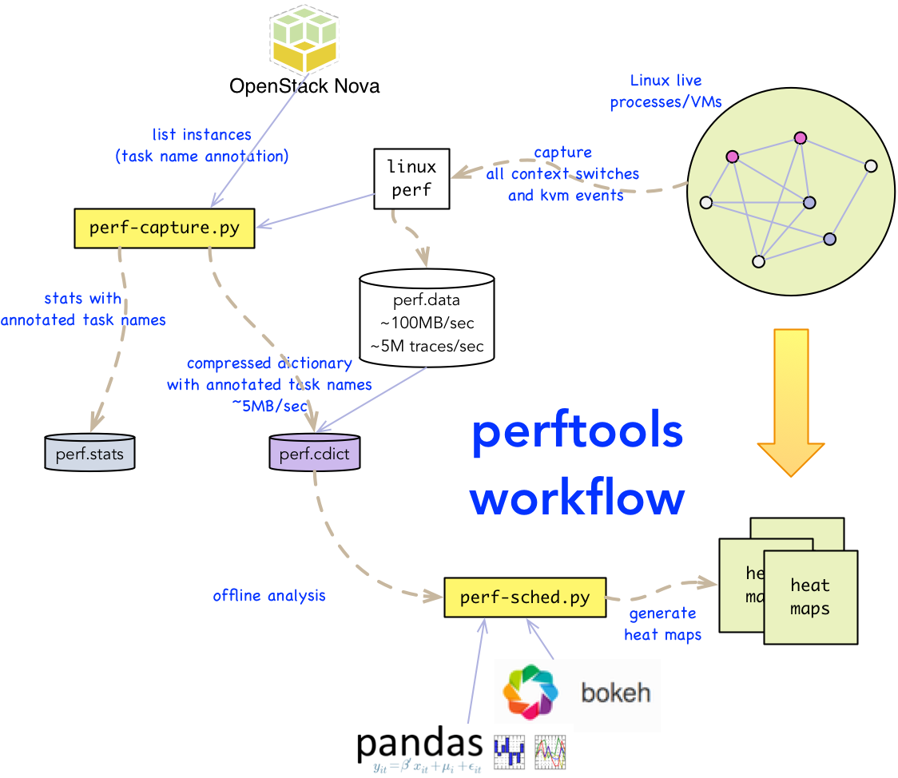

========================
perftools for Linux perf
========================

This repository contains a set of python scripts for helping tune any Linux system for performance and scale by
leveraging the Linux perf tool and generate from the perf traces:

- context switch heat maps
- KVM exit heat maps
- KVM exit types distribution (bar charts)
- core locality heat maps (where does task run over time)
- task scheduler assignment stats heat maps (% runs on each core per task)

The capture script leverges the Linux perf tool to capture events of interest (such as context switches, and kvm events).
For a more efficient analysis of the traces, it allows the user to add custom plugins to annotate task names on the fly.
One example of plugin included in the repository is the OpenStack plugin, that allows the capture tool to annotate task names based on their OpenStack instance name which often
provides much more contextual information about the task (such as instance type and service chaining metadata whne used in the NFV context).

Perftools workflow
------------------

Analyzing traces (perf-sched.py)
--------------------------------

Pre-requisites
^^^^^^^^^^^^^^
In all cases you will need python 2.7 and pip installed.

On the Linux server under test, the only requirement is to have a version of perf with python scripting enabled installed.
Unfortunately, some Linux distros such as Ubuntu now only package a version of perf that does not support python scripting (this is a compile time option).
In this case you will need to recompile perf with the proper compile flag, which is annoying but not too difficult to do if you follow the instructions to the letter.

Virtual environment
^^^^^^^^^^^^^^^^^^^

You may want to create a python virtual environment if you prefer to have isolation of python installations (this is recommended but optional).
For example:

.. code::

    virtualenv pft
    source pft/bin/activate

Remember to activate your virtual environment every time before installing or use the tool.

Binary Installation
^^^^^^^^^^^^^^^^^^^

(This will be provided later as a PyPI installation).

Source code Installation
^^^^^^^^^^^^^^^^^^^^^^^^

Clone the git repository and install the dependencies:

.. code::

    git clone git@github.com:cisco-oss-eng/perftools.git
    cd perftools
    pip install -r requirements.txt

To run the analyzer tool:

.. code::

    python perftools/perf-sched.py -h

Verifying your installation
^^^^^^^^^^^^^^^^^^^^^^^^^^^

Capturing traces (perf-capture.py)
----------------------------------

OpenStack Plug-In
-----------------
